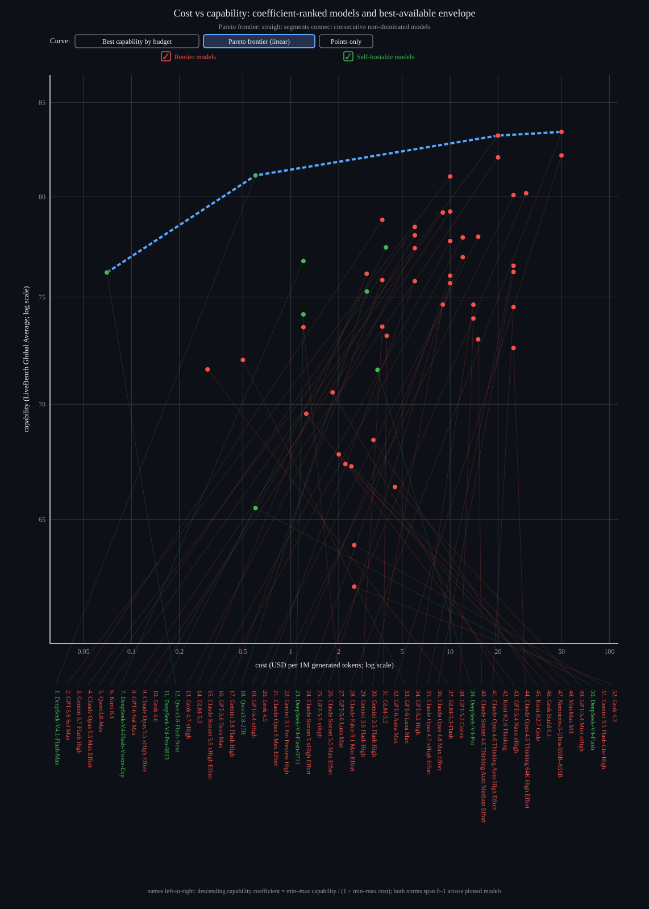

# LLM Pareto Frontier

People have this idea that "the frontier" means whatever is most expensive at any given moment. The reality is that a frontier is a boundary taht stretches across a range of possiblities. (Click the linear frontier button to see the difference)

If we consider the realtionship between cost and capability, then why would the most expensive or most capable ever be the answer? Each of these satisfies only one of the factors we're looking at. The "best" option is the one closest to the point of maximum capability and minimum cost (the top left corner).
